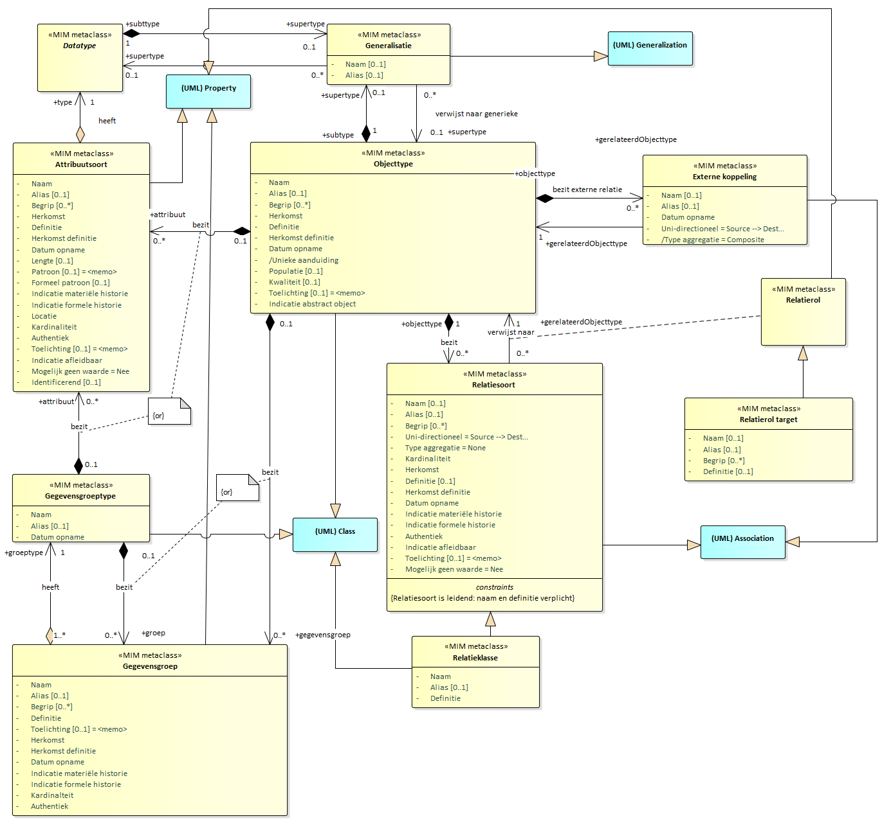
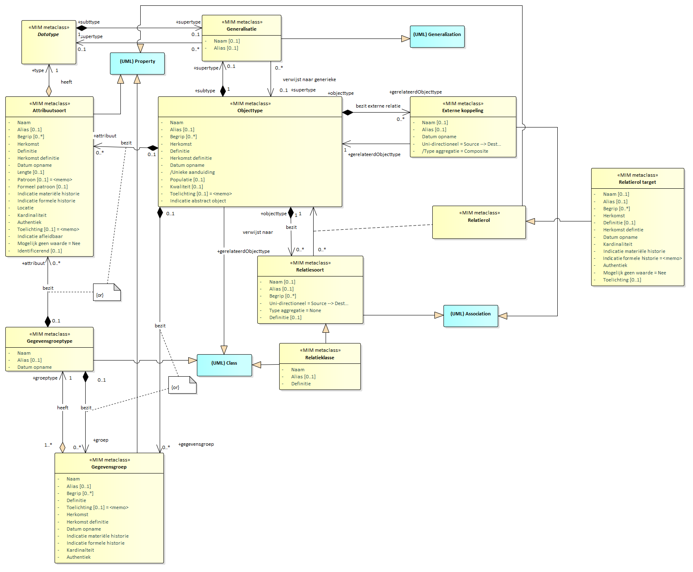

# Bijlagen

## Overzicht toegepaste UML metaclasses

## Modelelementen en metagegevens als diagram

Deze bijlage bevat alle modelelementen en metagegevens in één diagram.

*Kern - Relatiesoort is leidend (zie 2.3.2.1)*

*Kern - Relatierol is leidend (zie 2.3.2.2)*

*Datatypen*

## Template naamgeving conventies

| **Modelelement**               | **Naamgevingsconventie**  |   | **Voorbeeld** |
|--------------------------------|---------------------------|---|---------------|
|                                | *Objecttype*              |   |               |
| Naam objecttype                |                           |   |               |
|                                | *Attribuutsoort*          |   |               |
| Naam attribuutsoort            |                           |   |               |
|                                | *Relatiesoort*            |   |               |
| Naam relatie                   |                           |   |               |
|                                | *Gegevensgroeptype*       |   |               |
| Naam gegevensgroeptype         |                           |   |               |
|                                | *Gegevensgroep*           |   |               |
| Naam gegevensgroep             |                           |   |               |
|                                | *Externe koppeling*       |   |               |
| Naam externe koppeling         |                           |   |               |
|                                | *Relatieklasse*           |   |               |
| Naam relatieklasse             |                           |   |               |
|                                | *Referentielijst*         |   |               |
| Naam referentielijst           |                           |   |               |
|                                | *Referentie elemen*t      |   |               |
| Naam referentie element        |                           |   |               |
|                                | *Gestructureerd datatype* |   |               |
| *Naam Gestructureerd datatype* |                           |   |               |
|                                | *Data element*            |   |               |
| Naam data element              |                           |   |               |
|                                | *Datatype*                |   |               |
| *Naam datatype*                |                           |   |               |
|                                | *Union*                   |   |               |
| *Naam Union*                   |                           |   |               |
|                                | *Union element*           |   |               |
| *Naam union element*           |                           |   |               |
|                                | *Enumeratie*              |   |               |
| Naam enumeratie                |                           |   |               |
|                                | *Enumeratiewaarde*        |   |               |
| Code enumeratiewaarde          |                           |   |               |
| Naam enumeratiewaarde          |                           |   |               |

## Versielog

In deze versie zijn de volgende issues verwerkt:

| Issue                                                      | Omschrijving | 
|------------------------------------------------------------|--------------|
| [Issue #4](https://github.com/Geonovum/MIM-Werkomgeving/issues/4)    | EA type van Relatierol dient AssociationEnd te zijn. |
| [Issue #5](https://github.com/Geonovum/MIM-Werkomgeving/issues/5)    | UML metaclass aanpassen van Gegevensgroep |
| [Issue #6](https://github.com/Geonovum/MIM-Werkomgeving/issues/6)    | Kopjes "Specificatie voor Enumeratie(waarden)" aanpassen in par 2.3.6 |
| [Issue #8](https://github.com/Geonovum/MIM-Werkomgeving/issues/8)    | In Bijlage 1 staat nog "Complex datatype". |
| [Issue #9](https://github.com/Geonovum/MIM-Werkomgeving/issues/9)    | Eigen primitief datatype gebaseerd op een standaard primitief datatype (anders dan CharacterString) |
| [Issue #14](https://github.com/Geonovum/MIM-Werkomgeving/issues/14)  | Definities van dezelfde metadata aspecten verschillen soms (onbedoeld) |
| [Issue #15](https://github.com/Geonovum/MIM-Werkomgeving/issues/15)  | Informatie over eenheid opnemen |
| [Issue #25](https://github.com/Geonovum/MIM-Werkomgeving/issues/25)  | Interne referentie naar 3.5 formeel patroon klopt niet |
| [Issue #28](https://github.com/Geonovum/MIM-Werkomgeving/issues/28)  | Toepassing isId kan beter worden beschreven |
| [Issue #37](https://github.com/Geonovum/MIM-Werkomgeving/issues/37)  | Aspect "Identificerend" bij ReferentieElement abusievelijk "Identificatie" genoemd |
| [Issue #41](https://github.com/Geonovum/MIM-Werkomgeving/issues/41)  | Aspect "mogelijk geen waarde" heeft meerdere definities |
| [Issue #42](https://github.com/Geonovum/MIM-Werkomgeving/issues/42)  | Aspect "indicatie afleidbaar" heeft meerdere definities |
| [Issue #43](https://github.com/Geonovum/MIM-Werkomgeving/issues/43)  | Aspect "authentiek" heeft meerdere definities |
| [Issue #44](https://github.com/Geonovum/MIM-Werkomgeving/issues/44)  | Aspect "kardinaliteit" heeft meerdere definities |
| [Issue #45](https://github.com/Geonovum/MIM-Werkomgeving/issues/45)  | Aspect "indicatie formele historie" heeft meerdere definities |
| [Issue #46](https://github.com/Geonovum/MIM-Werkomgeving/issues/46)  | Aspect "indicatie materiële historie" heeft meerdere definities |
| [Issue #47](https://github.com/Geonovum/MIM-Werkomgeving/issues/47)  | Aspect "toelichting" heeft meerdere definities |
| [Issue #48](https://github.com/Geonovum/MIM-Werkomgeving/issues/48)  | Aspect "herkomst definitie" heeft meerdere definities |
| [Issue #49](https://github.com/Geonovum/MIM-Werkomgeving/issues/49)  | Aspect "definitie" heeft meerdere definities |
| [Issue #50](https://github.com/Geonovum/MIM-Werkomgeving/issues/50)  | Aspect "herkomst" heeft meerdere definities |
| [Issue #52](https://github.com/Geonovum/MIM-Werkomgeving/issues/52)  | Aspect "datum opname" heeft meerdere definities |
| [Issue #53](https://github.com/Geonovum/MIM-Werkomgeving/issues/53)  | Aspect "naam" heeft meerdere definities |
| [Issue #54](https://github.com/Geonovum/MIM-Werkomgeving/issues/54)  | Aspect per meta class of aspect als unieke properties |
| [Issue #55](https://github.com/Geonovum/MIM-Werkomgeving/issues/55)  | Aspect "constraint" ontbreekt in de tekst |
| [Issue #58](https://github.com/Geonovum/MIM-Werkomgeving/issues/58)  | Aspect "alias" ontbreekt in de tekst en komt ook niet voor in het UML bestand |
| [Issue #60](https://github.com/Geonovum/MIM-Werkomgeving/issues/60)  | Type fout constraint bij referentie element |

## Vertaling naar engels 

MIM is een specificatie die is ontstaan vanuit de behoeften van enkele basisregistraties en afnemers daarvan. Daarbij is de aansluiting bij internationale (geo)normen gewaarborgd. Echter de precieze aansluiting bij die normen is niet altijd expliciet gemaakt in MIM. 
Met name de relatie met de modelleertechnieken van de ISO 19100 serie is van belang. Deze ISO standaarden vormen de ondergrond voor o.a. Inspire en NEN3610. 

In het volgende overzicht geldt het volgende

Kolom Aard waarden:

- ST = Stereotype
- TV = Tagged value naam
- VAL =	Tagged value waarde

Kolom MIM  benaming ISO waarden:

- Als *schuin gedrukt*, dan is de naam overgenomen voor dezelfde constructie uit het General Feature Model [ISO 19109].

Kolom Reden waarden:
- Vertaling 	= Hetzelfde ding, vertaald in het Engels. De aansluiting bij ISO 19100 serie wordt daarbij expliciet gezocht.
- Precisering 	= De naam maakt de aard van het stereotype preciezer.

| **Aard**| **MIM 1.1**      				| **MIM benaming  ISO**  			| **Reden** 	|
|---------|---------------------------------|-----------------------------------|---------------|
|  ST     |	Objecttype       				|	*FeatureType* (ISO 19109) GF_FeatureType					|  Vertaling	|
|  ST     |	Attribuutsoort 					|	*AttributeType*	(ISO 19109) GF_AttributeType				|  Vertaling	|
|  ST     |	Gegevensgroeptype 				|	AttributeGroupType				|  Vertaling en precisering |
|  ST     |	Gegevensgroep  					|	AttributeGroup 					| Vertaling en precisering |
|  ST     |	Relatiesoort  					|	*AssociationType* (ISO 19109) GF_AssociationType				|  Vertaling	|
|  ST     |	Relatieklasse  					|	AssociationClass				|  Vertaling	|
|  ST     |	Externe koppeling	  			|   ExternalLink					|  Vertaling	|
|  ST     |	Relatierol  					|	*AssociationRole* (ISO 19109) GF_AssociationRole			|  Vertaling	|
|  ST     |	Referentielijst  				|	ReferenceList					|  Vertaling	|
|  ST     |	Referentie element  			|	ReferenceElement				|  Vertaling	|
|  ST     |	Enumeratie  					|	Enumeration						|  Vertaling	|
|  ST     |	Enumeratiewaarde  				|	Enum							|  Vertaling	|
|  ST     |	CodeList  						|	*CodeList*  (ISO 19103)     	|   	-		|
|  ST     |	Datatype	  					|   SimpleType						|  Vertaling en precisering |
|  ST     |	Complex datatype  				|	ComplexType					  	|  Vertaling	|
|  ST     |	Data element  					|	DataElement						|  Vertaling	|
|  ST     |	Keuze  							|	Union Defines a union data type.|	    -		|
|  ST     |	Keuze element	  				|   UnionElement					|  Vertaling	|
|  ST     |	Extern  						|	External						|  Vertaling	|
|  ST     |	View  							|	View							|  Vertaling	|
|  TV     |	Beheerder  						|	Administrator					|  Vertaling	|
|  TV     |	Data locatie  					|	Data location					|  Vertaling	|
|  TV     |	Datum opname                  	|	Date recorded					|  Vertaling	|
|  TV     |	Eigenaar                     	|	Owned by						|  Vertaling	|
|  TV     |	Formeel patroon               	|	Formal pattern					|  Vertaling	|
|  TV     |	Herkomst                     	|	Source							|  Vertaling	|
|  TV     |	Herkomst definitie	         	|   Origin of definition			|  Vertaling	|
|  TV     |	Indicatie authentiek	      	|   Indication authentic			|  Vertaling	|
|  TV     |	Indicatie formele historie	  	|   Indication formal history		|  Vertaling	|
|  TV     |	Indicatie materiële historie  	|	Indication material history		|  Vertaling	|
|  TV     |	Kwaliteit	  					|   Quality							|  Vertaling	|
|  TV     |	Lengte  						|	Length							|  Vertaling	|
|  TV     |	Locatie  						|	Location						|  Vertaling	|
|  TV     |	Mogelijk geen waarde  			|	Voidable						|  Vertaling	|
|  TV     |	Patroon  						|	Pattern							|  Vertaling	|
|  TV     |	Populatie  						|	Population						|  Vertaling	|
|  TV     |	Regels  						|	Rules							|  Vertaling	|
|  TV     |	Toelichting  					|	Description						|  Vertaling	|
|  VAL    |	Ja  							|	Yes								|  Vertaling	|
|  VAL    |	Nee	  							|   No								|  Vertaling	|
|  VAL    |	Zie groep  						|	See group						|  Vertaling	|
|  VAL    |	Authentiek	  					|   Authentic						|  Vertaling	|
|  VAL    |	Basisgegeven  					| 	Base data						|  Vertaling	|
|  VAL    |	Landelijk kerngegeven  			|	National base data				|  Vertaling	|
|  VAL    |	Gemeentelijk kerngegeven  		|	Municipal base data				|  Vertaling	|
|  VAL    |	Overig	  						|   Other							|  Vertaling	|
