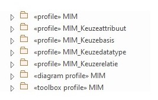
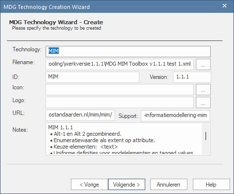
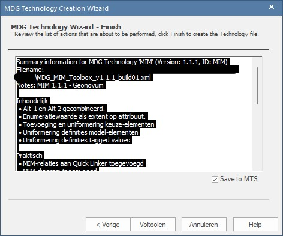

# HANDLEIDING MIM-PROFIEL, -TOOLBOX, -MDG GENEREREN

> NOTE: Versie, applicaties, etc.

 - Enterprise
 - SVN
 - GitHub

> NOTE: Inleidende tekst "Deze handleiding beschrijft ... "

## Inhoud
 1. Beschrijving doel etc.
 1. Benodigde bestanden
 1. Settings (versienummer, quick linker, etc.)
 1. Profielen genereren
 1. MDG genereren
 1. Resultaat controleren

## Beschrijving
 - Met al die profielen maak je een MDG MIM toolbox v1.1.1.xml
  - MTS is een configuratieprofiel
 - Dit is vooral handig als je vaker een MDG Technology gaat genereren
 - Voor MIM 1.1.1 bestaat dit bestand al
 - Voor profielen: zie afbeelding
 - Rood en groen

## Benodigde bestanden
 - EA-file (voor het genereren van de profiles en mdg technology)
 - MTS-file (voor het genreren van mdg technology)
 - CSV-file (voor het ... van de quick linker)

## X | WELKE PACKAGES ALS PROFIEL PUBLISEREN

Voor het maken van een MDG technology voor MIM, 
 1. `«profile» MIM`
 1. `«profile» Keuzeattribuut`
 1. `«profile» Keuzebasis`
 1. `«profile» Keuzedatatype`
 1. `«profile» Keuzerelatie`
 1. `«profile diagram» MIM`
 1. `«profile toolbox» MIM`

Daarnaast heb je nog een csv-bestand nodig voor de **quick linker** en een **mtsfile** waarin de belangrijkste informatie voor het generen van een MDG-technology al in is opgeslagen.

   

## X | NOG ONDERBRENGEN

 > **Opm: Een diagram moet je als als diagram publishen!** `Publish Diagram as UML Profile`

## X | STAP 1: PUBLICEER "PACKAGE" ALS UML PROFIEL
 - Kies package MIM-UML profiel
 - Je kiest per profiel
 - Ga naar: "Specialize" 
 - Kies: "Publish Technologie"
 - Kies: "Publish Pack As UML profile"

 - Typ: profile name: "MIM"
 - Kies: `<path>`
 - typ: version: `<versienummer>` (bijv.:1.1.1)

Let op er zijn twee belangrijke voorwaarden
 > **opm.**: [**CONTROLEREN**]De profile name moet overeenkomenm met de naam van het package.
Verder lijkt het erop of «profile» MIM en «toolbox profile» MIM niet alleen overeen moeten komen met de naam van het package, maar eveneens onderling ... 

1. De vier keuze-packages moeten een unieke naam hebben bij profile name (bijv. "MIM_Keuzeattribuut")
2. Het basisprofiel <naam> (iets van «profile» MIM), moet bij profile name dezelfde naam hebben als «toolbox profile» MIM

 > **opm**: ~zorg dat profile name en version overal exact hetzelfde zijn, anders werkt het profiel niet~. Dit kan eventueel met een XML-editor gerepareerd worden, maar voorkomen is beter dan genezen.

In MIM-toolbox diagram kun je aan de prefixen zien, wat de profile names moeten zijn
Als je diagram rtoevoegd moet je drie stappen doorlopen bij het selecteren van profielen

 - Klik: "Save"
 - Herhaal dit proces voor alle bovengenoemde onderdelen (dus ook voor toolbox profile)

 >**Let op**: de toolbox moet samengesteld worden uit verschillende profielen (lijst). Het 'basisprofiel' is ... en dat moet dezelfde naam hebb

## X | STAP 2: GENEREER MDG TECHNOLOGIE
 - Selecteer vervolgens het package waaronder alle subpackages vallen
 - Ga weer naar "Specialize"
 - Kies: "Publish Package"
 - Kies: "Generate MDG Technology"

 - Kies Volgende
 - Kies 'Open an existing MTS file'
 - Negeer de melding
 
 > **Opm**: De MTS file vult een aantal standaard configuraties vooraf in, maar je kunt deze tijdens het proces nog aanpassen.

 - Vanuit MTS file wordt het volgende venster al ingevuld
 - Technology: MIM
 - Filename: ingevuld, maar kun je zelf kiezen
 - ID: MIM
 - Version: 1.1.1

 > **Opm**: deze twee moeten dus kloppen met stap x in packages publiceren

 - Icon en logo blijven vooralsnog leeg.
 - URL: link naar corresponderende MIM-documentatie op GitHub/ReSpec.
 - Support, link naar website Geonovum.
 - Notes: Vul in het notes veld kort release notes in: wat is er nieuw/aangepast.
 - Klik 'Volgende'
 - Controleer de instellingen en klik op 'Ok'

 > **Opm**: In het metaprofiel zitten profiles en toolboxes

 - Alle configuraties kun je laden vanuit de MTF file.
 - Voor de eerste keer kun je ook een MTS-file genereren.
 - Select:  "Files To Be Included As Profiles".
 - Kies hier alle xml-bestanden, behalve de toolboxprofile.
 - Klik 'Volgende'.

 - Select: "Files To Be Included As Diagrams"
 - Kies hier het diagram profiel
 - Klik 'Volgende'.

 - In de volgende stap selecteer je tot slot het toolbox profiel.

 - Klik 'Volgende'.
 - Check de box "Save to MTS" en klik op 'Voltooien'
 - Indien je wijzigingen in de configuratie hebt aangebracht:
 - Kies checkbox  "Save To Mts"

 - Klik: "Voltooien"

## X | STAP 3: TEST DE TOOLBOX
 - Laad het MIM-profiel via "Resources"
 - maar er is een EAP-testf file
 - Verschillende manieren om de nieuwe toolbox te testen
 - Een model bouwen met alle MIM-mogelijkheden erin
 - Of: een nieuwe toolbox laden en update van het bestaande model uitvoeren
 - En dat kan door MIM metaklassen te slepen
 - Of door gebruik te maken va "Sync Tagged Values And Constraints"
 - Deze laatste optie vind je terug in het "Resources" menu

## X | MIM_MDG
 - profile helpers, model wizard: https://sparxsystems.com/enterprise_architect_user_guide/15.2/modeling/using_the_profile_helpers.html
 - Create Diagram Profiles using the Profile Helpers:https://sparxsystems.com/enterprise_architect_user_guide/15.2/modeling/create_diagram_profiles_using_.html
 - Morgen weer verder!

## X | Aandachtspunt
 - Tekstveld voor teolichting, niet initial value, maar notes veld als datatype
 - Uitgebreide toelichting wordt afgekapt vanwege maximale lengte.
 - Profiel niet elke keer opnieuw moeten laden door het kopppelen aan een (std.) diagram
 - MIM 1.1 build 1
 - Vorige versie had ook zo'n naam, dit kun je op website of github terugvinden. gaat om de naam van de het XML