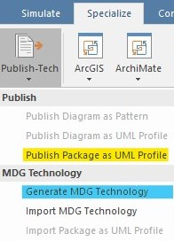
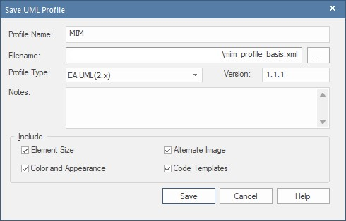
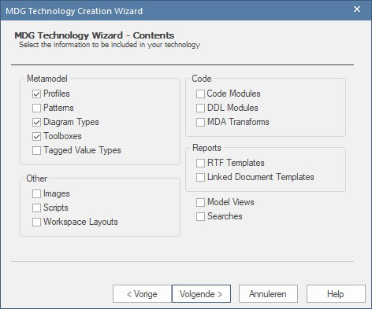
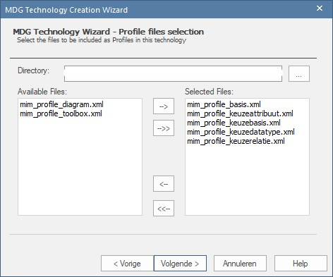
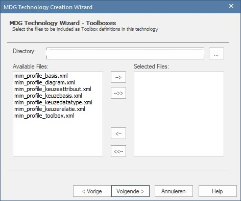

# HANDLEIDING MIM-PROFIEL, -TOOLBOX, -MDG GENEREREN

 - _Enterprise 15.2_
 - _SVN 1.14.1_
 - _GitHub_

## Inhoud
 1. Beschrijving doel etc.
 1. Benodigde bestanden
 1. Voorbereiding (todo)
 1. Aanpassingen (todo)
 1. Settings (versienummer, quick linker, etc.)
 1. Profielen genereren
 1. MDG genereren
 1. Resultaat controleren
 1. QuickLinker maken of bewerken (todo)

## Beschrijving
Deze handleiding beschrijft het proces voor het genereren van een customized toolbox voor modelleren met Enterprise Architect. Het gaat specifiek in op het maken van de _MIM-toolbox_. Maar ook voor het genereren customized toolboxen in het algemeen, biedt deze beschrijving een handig overzicht van de benodigde stappen. Een inhoudelijke beschrijving voor het maken van de benodigde profielen, vind je hier ([linkOpnemen](url)). De meest actuele versie van MIM kun je hier ([linkOpnemen](url)) raadplegen.

```diff
+ Er zijn 'x' stappen in het proces:.
+ Packages omzetten naar profielen
+ Profielen omzetten naar mdg tool
+ ...`
```

```diff
+ In deze bexchrijving gan we ervan uit dat de inhoud voor de toolbox al is aangemaakt
+ en dat deze in de juiste packages en dito structuur is opgenomen.
```

> NOTE: Nog iets zeggen over waar je inhoudelijke informatie over het maken van _profile packages_ kunt vinden (zelf schrijven en/of verwijzen naar _Sparx_/_profile helpers_)

## Benodigde bestanden
Controleer of je beschikt over alle benodigde bestanden:
 - EA-file met MIM profile packages voor het genereren van de profiles en mdg technology ([Create MDG Technology File](https://sparxsystems.com/enterprise_architect_user_guide/15.2/modeling/creatingmdgtechnologies.html)), hiertoe behoren tenminste één `«profile»` _package_, een `«diagram profile»` _package_ en een `«toolbox profile»` _package_ (zie voor meer informatie over ... ([linkOpnemenNaarWelkePackagesPubliceren](url)).
 - MTS-file met MIM properties voor het genereren van MDG Technology ([Working with MTS Files](https://sparxsystems.com/enterprise_architect_user_guide/16.0/modeling_frameworks/working_with_mts_files.html )) 
 - CSV-file met definities van de quick linkers ([Quick Linker Definition Format](https://sparxsystems.com/enterprise_architect_user_guide/16.0/modeling_frameworks/quick_linker_definition_format.html))

De MTS- en csv-file vind je [hier](https://github.com/Geonovum/MIM-Werkomgeving/tree/master/UML%20profieltooling/werkversie1.1.1).

## Benodigde profielen

 - Open met Enterprise Architect het project met de MIM-profielen
 - Ga in de project browser naar het package `MIM-UMLprofiel`
 - Controleer of daarin de benodigde _profile packages_ aanwezig zijn:


 - Controleer of in het _package_ `«profile» MIM` het element `«document» QuickLinker` aanwezig is.
 - Het csv-bestand van de QuickLinker is een kopie van de informatie die in dit element is opgeslagen. Als je wijzigingen wilt aanbrengen in de QuickLinker, of als er in het model wijzingen zijn doorgevoerd die van invloed zijn op de QuickLinker, kun je die met behulp van het csv-bestand aanpassen (hier [linkOpnemenNaarQuickLinkerMakenOfBewerken](url) lees je hoe dat moet).


 - Daarnaast heb je nog een **mtsfile** nodig waarin de belangrijkste informatie voor het generen van een MDG-technology al in is opgeslagen.
 - Tot slot is het handig om  ook het csv-bestand voor de **quick linker** achter de hand te hebben. In principe bevat het  «document» in het package «profile» MIM


Indien de packages met de profielen al als XML-bestand beschikbaar zijn (zie: ([linkOpnemenNaarPackagePublicerenAlsProfiel](url)), klik dan hier ([linkOpnemenGenererenToolbox](url)) om verder te gaan met het genereren van de toolbox

## X | STAP 1: PUBLICEER "PACKAGE" ALS UML PROFIEL
 - Kies package MIM-UML profiel.
 - Selecteer vervolgens één van de bovengenoemde profielen.
 - Ga naar: _Specialize_.
 - Kies _Publish Package as UML Profile_.
 - En klik op: _Publish Pack As UML profile_.
 - Er verschijnt nu een nieuw venster.



 - Voer _profile name_ in: _MIM_.
 - Kies de locatie waar je het profiel wilt opslaan en geef het bestand een herkenbare naam 
 - Voer het versienummer van MIM in waar deze toolbox mee moet kloppen, version: `<versienummer>` (bijv.:`1.1.1`).



Let op er zijn twee belangrijke voorwaarden
 > **opm.**: [**CONTROLEREN**]De profile name moet overeenkomenm met de naam van het package.
Verder lijkt het erop of «profile» MIM en «toolbox profile» MIM niet alleen overeen moeten komen met de naam van het package, maar eveneens onderling ... 

1. De vier keuze-packages moeten een unieke naam hebben bij profile name (bijv. "MIM_Keuzeattribuut")
2. Het basisprofiel <naam> (iets van «profile» MIM), moet bij profile name dezelfde naam hebben als «toolbox profile» MIM

 > **opm**: ~zorg dat profile name en version overal exact hetzelfde zijn, anders werkt het profiel niet~. Dit kan eventueel met een XML-editor gerepareerd worden, maar voorkomen is beter dan genezen.

In MIM-toolbox diagram kun je aan de prefixen zien, wat de profile names moeten zijn
Als je diagram rtoevoegd moet je drie stappen doorlopen bij het selecteren van profielen

 - Klik: "Save"
 - Herhaal dit proces voor alle bovengenoemde onderdelen (dus ook voor toolbox profile)

 >**Let op**: de toolbox moet samengesteld worden uit verschillende profielen (lijst). Het 'basisprofiel' is ... en dat moet dezelfde naam hebb

## X | STAP 2: GENEREER MDG TECHNOLOGIE
 - Selecteer vervolgens het package waaronder alle subpackages vallen
 - Ga weer naar "Specialize"
 - Kies: "Publish Package"
 - Kies: "Generate MDG Technology"


 - Kies Volgende
 - Kies 'Open an existing MTS file'
 - Negeer de melding
 
 > **Opm**: De MTS file vult een aantal standaard configuraties vooraf in, maar je kunt deze tijdens het proces nog aanpassen.

 - Vanuit MTS file wordt het volgende venster al ingevuld
 - Technology: MIM
 - Filename: ingevuld, maar kun je zelf kiezen
 - ID: MIM
 - Version: 1.1.1


 > **Opm**: deze twee moeten dus kloppen met stap x in packages publiceren

 - Icon en logo blijven vooralsnog leeg.
 - URL: link naar corresponderende MIM-documentatie op GitHub/ReSpec.
 - Support, link naar website Geonovum.
 - Notes: Vul in het notes veld kort release notes in: wat is er nieuw/aangepast.
 - Klik 'Volgende'
 - Controleer de instellingen en klik op 'Ok'



 > **Opm**: In het metaprofiel zitten profiles en toolboxes

 - Alle configuraties kun je laden vanuit de MTF file.
 - Voor de eerste keer kun je ook een MTS-file genereren.
 - Select:  "Files To Be Included As Profiles".
 - Kies hier alle xml-bestanden, behalve de toolboxprofile.
 - Klik 'Volgende'.



 - Select: "Files To Be Included As Diagrams"
 - Kies hier het diagram profiel
 - Klik 'Volgende'.


 - In de volgende stap selecteer je tot slot het toolbox profiel.



 - Klik 'Volgende'.
 - Check de box "Save to MTS" en klik op 'Voltooien'
 - Indien je wijzigingen in de configuratie hebt aangebracht:
 - Kies checkbox  "Save To Mts"


 - Klik: "Voltooien"

## X | STAP 3: TEST DE TOOLBOX
 - Laad het MIM-profiel via "Resources"
 - maar er is een EAP-testf file
 - Verschillende manieren om de nieuwe toolbox te testen
 - Een model bouwen met alle MIM-mogelijkheden erin
 - Of: een nieuwe toolbox laden en update van het bestaande model uitvoeren
 - En dat kan door MIM metaklassen te slepen
 - Of door gebruik te maken va "Sync Tagged Values And Constraints"
 - Deze laatste optie vind je terug in het "Resources" menu

## X | MIM_MDG
 - profile helpers, model wizard: https://sparxsystems.com/enterprise_architect_user_guide/15.2/modeling/using_the_profile_helpers.html
 - Create Diagram Profiles using the Profile Helpers:https://sparxsystems.com/enterprise_architect_user_guide/15.2/modeling/create_diagram_profiles_using_.html
 - Morgen weer verder!

## X | Aandachtspunt
 - Tekstveld voor teolichting, niet initial value, maar notes veld als datatype
 - Uitgebreide toelichting wordt afgekapt vanwege maximale lengte.
 - Profiel niet elke keer opnieuw moeten laden door het kopppelen aan een (std.) diagram
 - MIM 1.1 build 1
 - Vorige versie had ook zo'n naam, dit kun je op website of github terugvinden. gaat om de naam van de het XML