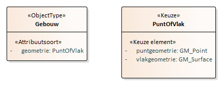

#### Was:

#### Union

>   **Definitie Union**

>   Gestructureerd datatype, waarmee wordt aangegeven dat er meer dan één
>   mogelijkheid is voor het datatype van een attribuut. Het attribuut zelf
>   krijgt als datatype de union. De union biedt een keuze uit verschillende
>   datatypes, elk afzonderlijk beschreven in een union element.

~~~~~~~~~~~~~~~~~~~~~~~~~~~~~~~~~~~~~~~~~~~~~~~~~~~~~~~~~~~~~~~~~~~~~~~~~~~~~~~~
Union LineOrPolygon. Deze biedt een keuze uit Union element Line of Union element Polygon.
~~~~~~~~~~~~~~~~~~~~~~~~~~~~~~~~~~~~~~~~~~~~~~~~~~~~~~~~~~~~~~~~~~~~~~~~~~~~~~~~

#### Union element

>   **Definitie Union element**

>   Een type dat gebruikt kan worden voor het attribuut zoals beschreven in de
>   definitie van Union. Het union element is een onderdeel van een Union,
>   uitgedrukt in een eigenschap (attribute) van een union, die als keuze binnen
>   de Union is gerepresenteerd..

~~~~~~~~~~~~~~~~~~~~~~~~~~~~~~~~~~~~~~~~~~~~~~~~~~~~~~~~~~~~~~~~~~~~~~~~~~~~~~~~
Union element Line en union element Polygon zijn beiden onderdeel van Union LineOrPolygon.
~~~~~~~~~~~~~~~~~~~~~~~~~~~~~~~~~~~~~~~~~~~~~~~~~~~~~~~~~~~~~~~~~~~~~~~~~~~~~~~~

~~~~~~~~~~~~~~~~~~~~~~~~~~~~~~~~~~~~~~~~~~~~~~~~~~~~~~~~~~~~~~~~~~~~~~~~~~~~~~~~

~~~~~~~~~~~~~~~~~~~~~~~~~~~~~~~~~~~~~~~~~~~~~~~~~~~~~~~~~~~~~~~~~~~~~~~~~~~~~~~~

#### Keuze

>   **Definitie Keuze**

Gestructureerd data type zonder identiteit waarvan precies één van de
eigenschappen aanwezig is in elke instantie. De union kent drie verschillende
keuze typen: een keuze uit verschillende attributen, uit verschillende datatypes
of keuze uit verschillende target objectypen die met één relatie gerelateerd
worden. Elk keuze-element is afzonderlijk beschreven in een union-element.

#### Keuze element

>   **Definitie Keuze element**

>   Een type dat gebruikt kan worden voor het attribuut zoals beschreven in de
>   definitie van Keuze. Het keuze element is een onderdeel van een klasse met
>   het stereotype Keuze, uitgedrukt in een eigenschap (attribute) van die
>   klasse.

Toelichting:

Het stereotype \<\<Keuze\>\> wordt gebruikt voor drie verschillende keuze
opties:

1.  keuze tussen: attributen die onder één hoofdattribuut vallen

2.  keuze tussen: datatypen die bij één attribuut horen

3.  keuze tussen: relatietargets die bij één relatie horen

Alle drie hebben een eigenwaarde voor een tagged value ‘keuzetype’ bij
\<\<Keuze\>\>. Afhankelijk van de toepassing betekent het conceptueel iets
anders. Encoding regels moeten hier rekening mee houden.

**1) Keuze uit attributen die onder één hoofdattribuut vallen**: (tagged value
‘keuzetype”= attribuut

Voorbeeld:

Een objecttype persoon heeft een attribuut telefoonnummer. Het telefoonnummer is
het privenummer of werknummer.

Conceptueel zijn de attributen telefoonnummer, privenummer en werknummer van
belang deze zullen daarom ook in een technische omgeving geimplementeerd moeten
worden.

**2) Keuze uit datatypen bij één attribuut:** (tagged value ‘keuzetype’=
datatype

Voorbeeld:

Een objecttype Gebouw heeft een attribuut geometrie. Het geometrietype kan punt
(GM_Point) of vlak (GM_Surface) zijn. Het attribuut geometrie heeft in dit geval
als datatype de \<\<Keuze\>\> PuntOfVlak met twee attributen
puntgeometrie.GM_Point en vlakgeometrie.GM_Surface.

In het conceptuele model hebben het PuntOfVlak en de beide attribuutnamen geen
betekenis en zijn alleen om de datatype GM_Surface en GM_Point te koppelen aan
het attribuut geometrie. In een technische omgeving moeten ze daarom niet
geimplementeerd worden.

**3) Keuze uit verschillende target objecttypen met één relatie.**

Voorbeeld:

Een objecttype JuridischDocument heeft een relatie ‘betreft rechtspersoon’ naar
of een objecttype NatuurlijkPersoon of een objecttype NietNatuurlijkPersoon.

~~~~~~~~~~~~~~~~~~~~~~~~~~~~~~~~~~~~~~~~~~~~~~~~~~~~~~~~~~~~~~~~~~~~~~~~~~~~~~~~

~~~~~~~~~~~~~~~~~~~~~~~~~~~~~~~~~~~~~~~~~~~~~~~~~~~~~~~~~~~~~~~~~~~~~~~~~~~~~~~~
